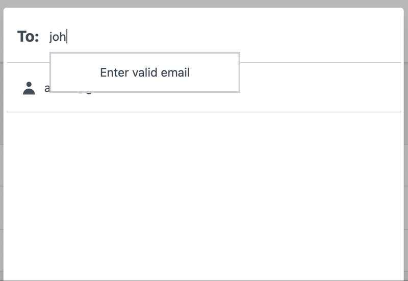

# Description
Adds Share Functionality in your Laravel Projects.

[](https://packagist.org/packages/geekyants/share-dialog)
[](https://travis-ci.org/geekyants/share-dialog)
[](https://scrutinizer-ci.com/g/geekyants/share-dialog)
[](https://packagist.org/packages/geekyants/share-dialog)




---

## Introduction

Share-dialog is a composer package for laravel projects which allows other users to read/write your project's entities. 

It helps in managing roles and permissions for any app using Eloquent models. You can assign read or write ability to the user with whom you want to share your entity and remove the ability if you want to.

---

## Prerequisites

Make sure you have [Inertia,](https://inertiajs.com/)[Tailwind](https://tailwindcss.com/) and [Vue](https://vuejs.org/) installed.

If you have [Bouncer](https://github.com/JosephSilber/bouncer) and [Vue-Multiselect](https://vue-multiselect.js.org/) pre-installed you can move to the [Installation](###installation) section.

### **Bouncer**

Install Bouncer with composer:

```bash
composer require silber/bouncer v1.0.0-rc.10
```

Add Bouncer's trait to your user model:

```bash
use Silber\Bouncer\Database\HasRolesAndAbilities;

class User extends Model
{
    use HasRolesAndAbilities;
}
```

Publish the bouncer's migrations into your app's migrations directory, by running the following command:

```bash
php artisan vendor:publish --tag="bouncer.migrations"
```

### **VueMultiSelect**

```bash
npm install vue-multiselect --save
```

---

## **Installation**


Install package with composer

```bash
composer require  geekyants/share-dialog
```

After installation, move the package's config file to your project's config folder by executing the following command-

```bash
php artisan vendor:publish  --tag="config"
```

Moving forward, scaffold the view components present in the share-dialog package.

```jsx
php artisan install:share-dialog
```

A **Share-Dialog** folder containing Vuejs components would be created in your resources directory. Now, you can easily customize your share-dialog's  Vuejs components.  :)

 Run the migrations. After executing this command, Bouncer migrations and new_users_share_dialog table would be migrated.

```bash
php artisan migrate
```

To compile and minify the CSS and JavaScript files generated by share-dialog, add this to your webpack.mix.js.

```php
.js("resources/js/share-dialog.js", "public/js")
    .postCss("resources/css/share-dialog.css", "public/css", [
        require("postcss-import"),
        require("tailwindcss"),
        require("autoprefixer")
    ])
.vue()
```

Finally, build your assets

```bash
npm run dev
```

---

## Usage

To share your entity with other users visit-

 `{APP_URL}/share-dialog/{entity_name}/{entity_id}`

For example, if you want to open share dialog for your Project model with id 123

then visit 

`{APP_URL}/share-dialog/projects/123`

> Note: The entity_name should have the same name as that of the database migration corresponding to the model that you want to share.
<br><br>

 **Share-Dialog sends error messages back to your application in the error props.**


If you invite a user which is not present in your database, share-dialog automatically creates it in your users table. Also, a new entry is inserted into the new_users_share_dialog table referencing the **user's id** as a foreign key and setting **has_ever_logged_in** property to false.<br><br>

> Note: To restrict the other users from accessing your entities you have to explicitly use the Bouncer methods. You can check them out [here](https://github.com/JosephSilber/bouncer#cheat-sheet).

---

## Customization

You can customize the functionality of share-dialog easily by making changes in the **share-dialog.php** file present in your config folder.

1. If your model files are present in some other folder other than "**App\Models\\"** you can set the **modelPath** to the path of that folder.
2. If you want to add your own custom middleware to the share-dialog, append it into the middleware array. For example, if you want to add the **"admin"** middleware then your middleware array would look like this-

    ```php
    "middleware" => ['web', 'auth','admin']
    ```

3. If you want only certain entities to be shareable you can add them into the **restrict-entities** array. For example, if your want only the '**files'** entity to be shareable-

    ```php
    'restrict-entities' => ['files'],
    ```

4. ShareDialog sends an email notification to the users when they are given access to an entity. [I](http://access.Id)f you want to disable it you can set **sendEmail** to false in the share-dialog.config file.

    You can modify the email template by publishing the share-dialog mail resources. After running this command, the mail notification template will be located in the 

    resources/vendor/share-dialog/mail directory.

    ```php
    php artisan vendor:publish  --tag="mail"
    ```

5. ShareDialog fires an **UserAbilityChanged** event when the user's access gets changed. If you want to attach your own listeners to that event you can add them to the listener's property in the EventServiceProvider of your application.

    For example, if you want to to attach SendSlackNotification listener to the event 

    ```php
    use Geekyants\ShareDialog\Events\UserAbilityChanged;

    ...

    protected $listen = [
            UserAbilityChanged::class => [
                SendSlackNotification::class,
            ]   
        ];
    ```


## License

The MIT License (MIT). Please see [License File](LICENSE.md) for more information.
