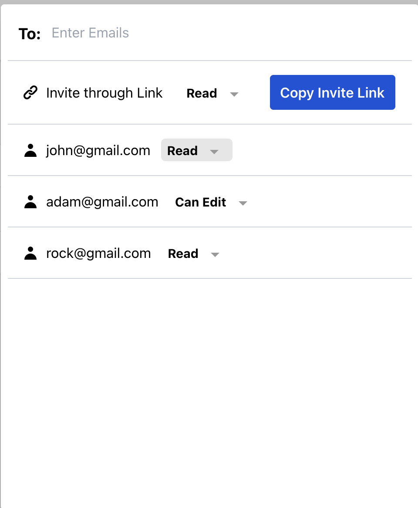

# Description

[](https://packagist.org/packages/geekyants/share-dialog)
[](https://travis-ci.org/geekyants/share-dialog)
[](https://scrutinizer-ci.com/g/geekyants/share-dialog)
[](https://packagist.org/packages/geekyants/share-dialog)



Adds Share Functionality in your Laravel Projects.

## Introduction

Share-dialog is a composer package for laravel projects which allows other users to read/write your project's entities.

It helps in managing roles and permissions for any app using Eloquent models. You can assign read or write ability to the user with whom you want to share your entity and remove the ability if you want to.

## Prerequisites

Make sure you have [Inertia]("https://inertiajs.com/") installed with Vuejs configuration.

If you have [Bouncer]("https://github.com/JosephSilber/bouncer") and [Vue-Multiselect]("https://vue-multiselect.js.org/") already installed you can move to the Installation section.

### Bouncer

Install Bouncer with composer:

```
composer require silber/bouncer v1.0.0-rc.10
```

Add Bouncer's trait to your user model:

```
use Silber\Bouncer\Database\HasRolesAndAbilities;

class User extends Model
{
    use HasRolesAndAbilities;
}
```

Now, to run Bouncer's migrations, first publish the migrations into your app's migrations directory, by running the following command:

```
php artisan vendor:publish --tag="bouncer.migrations"
```

Finally, run the migrations:

```
php artisan migrate
```

### VueMultiSelect

```
npm install vue-multiselect --save
```

## Installation

You can install the package via composer:

```bash
composer require geekyants/share-dialog
```

After installation, move the package's config file to your project's config folder by executing the following command-

```
php artisan vendor:publish  --tag="config"
```

A **share-dialog.php** file will be created in your config folder. Open the file and set the **inertiaPath** to the folder in which your client-side Vue.js files are present.
For example, if they are present in the Pages folder(`resources/js/Pages/...`**),** set **"inertiaPath"** to **"Pages"**.

```
return [
    "modelPath" => "App\Models\\",
    "inertiaPath" => "Pages",
    'middleware' => ['web', 'auth'],
];
```

By default the **inertiaPath** is set to the **"Pages"** folder.

You can change the modelPath to the folder in which your model files are present. By default the modelPath is set to `"App\Models\\"`

Also, if you want to add your custom middleware to the share-dialog, append it into the middleware array.

For example, if you want to use the `"admin"` middleware then your middleware array would look like this
`"middleware" => ['web', 'auth','admin']`

Moving forward, publish the share-dialog package's assets into your project.

```
php artisan vendor:publish  --tag="assets"
```

A ShareDialog folder containing Vuejs files would be created in the folder that you have set as the inertiaPath in share-dialog.php

Lastly, open the HandleInertiaRequests.php file present in the Middleware folder and send flash messages to the Vue components through shared data.

```
return array_merge(parent::share($request), [
            'flash' => function () use ($request) {
                return [
                    'success' => $request->session()->get('success'),
                    'error' => $request->session()->get('error'),
                ];
            },
        ]);
```

---

## Usage

To share your entity with other users visit-

`{APP_URL}/share-dialog/{entity_name}/{entity_id}`

For example, if you want to open share dialog for your Post model with id 123 then visit-

`{APP_URL}/share-dialog/posts/123`
<br><br>

> Note: The entity_name should have the same name as that of the database migration corresponding to the model that you want to share.

---

## License

The MIT License (MIT). Please see [License File](LICENSE.md) for more information.
